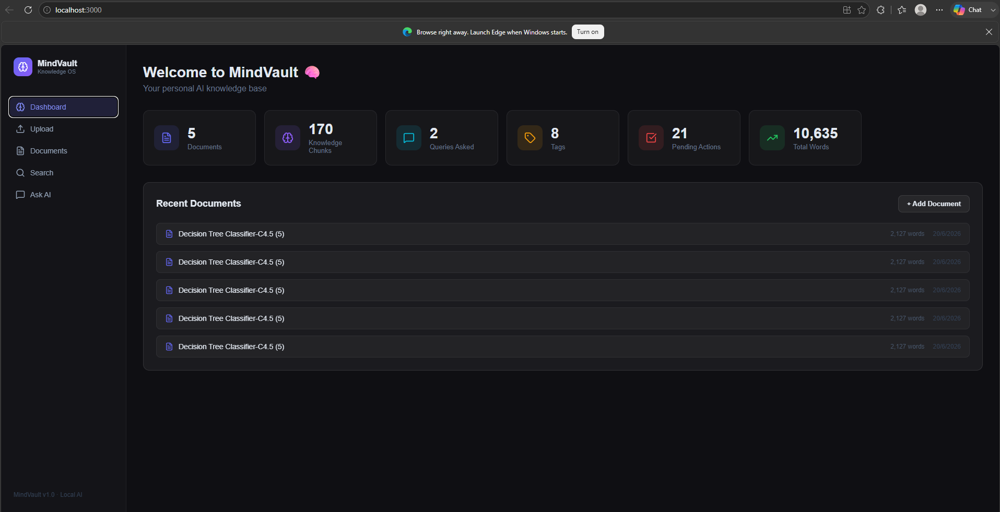
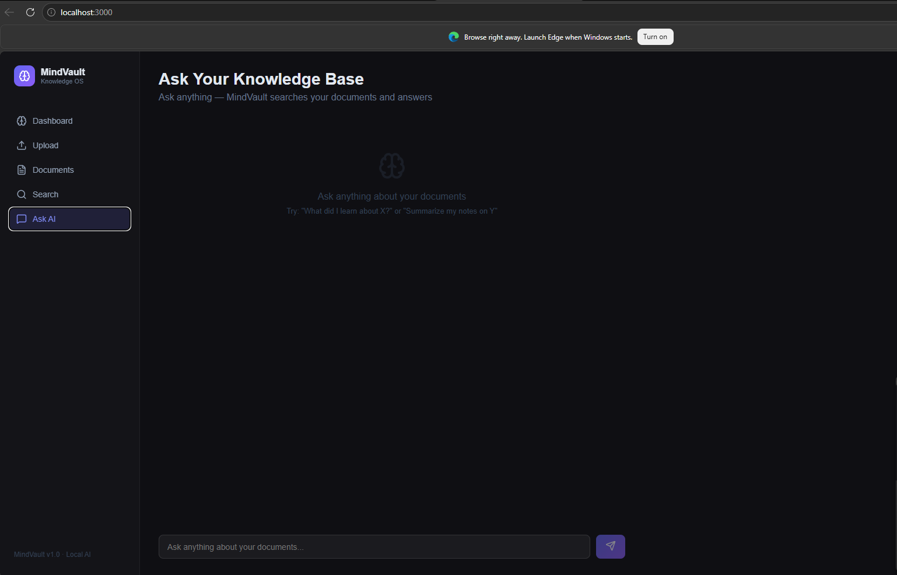

 # 🧠 MindVault — Personal AI Knowledge Base

A local-first, privacy-preserving AI memory system powered by RAG (Retrieval-Augmented Generation). Upload your documents and ask questions — MindVault finds answers from YOUR content, not the internet.



## ✨ Features

- 📄 **Multi-format ingestion** — PDF, TXT, Markdown, JSON
- 🔍 **Hybrid search** — Semantic + keyword search
- 🤖 **AI-powered answers** — Grounded strictly in your documents
- 🏷️ **Auto-tagging** — Automatic tag extraction per document
- ✅ **Action item extraction** — Detects tasks and decisions
- 📊 **Analytics dashboard** — Track your knowledge base growth
- 🔒 **100% local** — No data leaves your machine
- 🆓 **Completely free** — No API costs, runs on Ollama

## 🛠️ Tech Stack

| Layer | Technology |
|---|---|
| LLM | Ollama (llama3.1:8b) |
| Embeddings | nomic-embed-text |
| Vector DB | ChromaDB |
| Backend | Flask + Python 3.12 |
| Frontend | React + TailwindCSS |
| Database | SQLite |

## 🚀 Quick Start

### Prerequisites
- Python 3.12+
- Node.js 18+
- [Ollama](https://ollama.ai) installed and running

### 1. Clone the repo
```bash
git clone https://github.com/lavanyhub/mindvault.git
cd mindvault
```

### 2. Pull required models
```bash
ollama pull llama3.1:8b
ollama pull nomic-embed-text
```

### 3. Setup backend
```bash
py -3.12 -m venv venv
venv\Scripts\activate
pip install -r backend/requirements.txt
```

### 4. Run backend
```bash
python backend/app.py
```

### 5. Run frontend
```bash
cd frontend
npm install
npm start
```

### 6. Open browser
```
http://localhost:3000
```

## 📁 Project Structure

```
MindVault/
├── backend/
│   ├── app.py              # Flask app entry point
│   ├── config.py           # Configuration
│   ├── database.py         # SQLite schema
│   ├── requirements.txt    # Python dependencies
│   ├── api/
│   │   └── routes.py       # REST API endpoints
│   └── core/
│       ├── ingestor.py     # Document ingestion
│       ├── embedder.py     # ChromaDB vector store
│       ├── summarizer.py   # LLM processing
│       └── retriever.py    # RAG retrieval
└── frontend/
    └── src/
        ├── App.js          # Main app + routing
        ├── api.js          # API client
        └── pages/
            ├── Dashboard.js
            ├── Upload.js
            ├── Documents.js
            ├── Search.js
            └── Query.js
```

## 🔌 API Endpoints

| Method | Endpoint | Description |
|---|---|---|
| POST | `/api/documents/upload` | Upload and process document |
| GET | `/api/documents` | List all documents |
| DELETE | `/api/documents/:id` | Delete document |
| POST | `/api/query` | Ask AI a question |
| POST | `/api/search` | Search knowledge base |
| GET | `/api/analytics` | Get usage stats |

## 📸 Screenshots

### Dashboard


### Ask AI


## 🗺️ Roadmap

- [ ] Cloud backup (Supabase)
- [ ] Multi-user support
- [ ] Web URL ingestion
- [ ] Voice input
- [ ] Mobile app

## 👤 Author

Built by [Lavan](https://github.com/lavanyhub) — CS student at Thapar University specializing in AI & RAG systems.

## 📄 License

MIT
