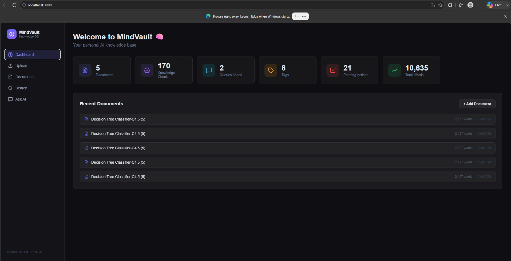
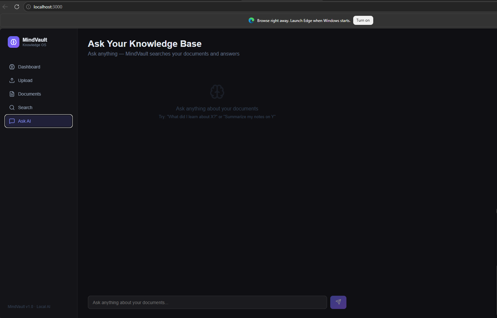

 # 🧠 MindVault — Personal AI Knowledge Base

A local-first, privacy-preserving AI memory system powered by RAG (Retrieval-Augmented Generation). Upload your documents and ask questions — MindVault finds answers from YOUR content, not the internet.



## ✨ Features

- 📄 **Multi-format ingestion** — PDF, TXT, Markdown, JSON, processed asynchronously with live progress
- 🔍 **Real hybrid search** — Semantic (ChromaDB) + keyword (SQLite FTS5/BM25), fused with Reciprocal Rank Fusion, reranked with a cross-encoder
- 🤖 **AI-powered answers** — Grounded strictly in your documents, streamed token-by-token
- 🏷️ **Auto-tagging** — Automatic tag extraction per document
- ✅ **Action item extraction** — Detects tasks and decisions
- 📊 **Analytics dashboard** — Track your knowledge base growth
- 🔒 **100% local** — No data leaves your machine
- 🆓 **Completely free** — No API costs, runs on Ollama

## 🧭 Architecture

```
                     ┌─────────────────────┐
  Upload ──validate──▶  documents (SQLite)  │
    │       + chunk    └─────────────────────┘
    │                             │
    │ (background job, core/jobs.py)
    ▼                             ▼
┌────────────────┐      ┌──────────────────────┐
│ ChromaDB        │      │ chunks_fts (SQLite    │
│ (dense vectors) │      │ FTS5, BM25 ranking)   │
└────────┬────────┘      └──────────┬───────────┘
         │  vector search           │  keyword search
         ▼                          ▼
              core/retriever.py
        Reciprocal Rank Fusion (k=60)
                    │
                    ▼
        core/reranker.py — cross-encoder
        (ms-marco-MiniLM-L-6-v2) rerank
                    │
                    ▼
          top-5 chunks ──▶ Ollama LLM ──▶ streamed answer (SSE)
```

Query and upload requests return immediately; the expensive work (embedding, five LLM extraction calls, generation) runs off the request thread with SSE progress/streaming so the UI never blocks on it. See `UPGRADE_PLAN.md` for the full design rationale, including why RRF over score-normalization, why a cross-encoder retrieve-then-rerank stage, and why SQLite FTS5 over a separate BM25 dependency.

## 🛠️ Tech Stack

| Layer | Technology |
|---|---|
| LLM | Ollama (llama3.1:8b) |
| Embeddings | nomic-embed-text |
| Vector DB | ChromaDB |
| Backend | Flask + Python 3.12 |
| Frontend | React + TailwindCSS |
| Database | SQLite |

## 🚀 Quick Start

### Prerequisites
- Python 3.12+
- Node.js 18+
- [Ollama](https://ollama.ai) installed and running

### 1. Clone the repo
```bash
git clone https://github.com/lavanyhub/mindvault.git
cd mindvault
```

### 2. Pull required models
```bash
ollama pull llama3.1:8b
ollama pull nomic-embed-text
```

### 3. Setup backend
```bash
py -3.12 -m venv venv
venv\Scripts\activate
pip install -r backend/requirements.txt
```

### 4. Run backend
```bash
python backend/app.py
```

### 5. Run frontend
```bash
cd frontend
npm install
npm start
```

### 6. Open browser
```
http://localhost:3000
```

## 📁 Project Structure

```
MindVault/
├── backend/
│   ├── app.py              # Flask app entry point
│   ├── config.py           # Configuration
│   ├── database.py         # SQLite schema
│   ├── requirements.txt    # Python dependencies
│   ├── api/
│   │   └── routes.py       # REST API endpoints
│   └── core/
│       ├── ingestor.py     # Document ingestion
│       ├── embedder.py     # ChromaDB vector store
│       ├── summarizer.py   # LLM processing
│       └── retriever.py    # RAG retrieval
├── eval/
│   ├── metrics.py               # Recall@k, MRR, nDCG@5
│   ├── build_golden_set.py      # drafts Q&A pairs from your own uploaded chunks
│   ├── golden_set.example.json  # schema reference (not real eval data)
│   ├── evaluate_retrieval.py    # A/B/C/D config comparison
│   ├── evaluate_answers.py      # groundedness + refusal accuracy (LLM-as-judge)
│   └── results/                 # generated reports land here
└── frontend/
    └── src/
        ├── App.js          # Main app + routing
        ├── api.js          # API client
        └── pages/
            ├── Dashboard.js
            ├── Upload.js
            ├── Documents.js
            ├── Search.js
            └── Query.js
```

## 🔌 API Endpoints

| Method | Endpoint | Description |
|---|---|---|
| POST | `/api/documents/upload` | Upload document; returns `202` with a `job_id` immediately, processing continues in the background |
| GET | `/api/documents` | List all documents |
| DELETE | `/api/documents/:id` | Delete document |
| GET | `/api/jobs/:job_id` | Poll ingestion job status |
| GET | `/api/jobs/:job_id/stream` | SSE stream of ingestion job progress |
| POST | `/api/query` | Ask AI a question (non-streaming) |
| POST | `/api/query/stream` | Ask AI a question; SSE stream of sources then answer tokens |
| POST | `/api/search` | Hybrid search (vector + BM25, RRF-fused, reranked) |
| GET | `/api/analytics` | Get usage stats |

## 📈 Evaluation

Retrieval and answer quality are measured against a golden set of question/answer pairs, not asserted. This repo ships the harness and an example schema — the numbers below only exist once you've uploaded real documents and generated a golden set from them (`eval/build_golden_set.py` drafts candidates from your actual chunks; multi-hop and negative cases need to be added by hand, see that script's docstring).

```bash
cd backend
python ../eval/evaluate_retrieval.py   # -> eval/results/report.md
python ../eval/evaluate_answers.py     # -> eval/results/answer_quality.md
```

| Config | Recall@5 | MRR | nDCG@5 |
|---|---|---|---|
| A. Vector only | _run the harness_ | _run the harness_ | _run the harness_ |
| B. BM25 only | _run the harness_ | _run the harness_ | _run the harness_ |
| C. Hybrid + RRF | _run the harness_ | _run the harness_ | _run the harness_ |
| D. Hybrid + RRF + rerank | _run the harness_ | _run the harness_ | _run the harness_ |

Replace this table with the contents of `eval/results/report.md` once you've run it against your own data — don't hand-fill it, the point of the harness is that these numbers are reproducible.

## 📸 Screenshots

### Dashboard


### Ask AI


## ⚠️ Limitations

Honest scope, not a full feature-gap list — the design choices below were made deliberately for a local-first, single-user tool and would need revisiting for anything bigger:

- **Single-user, no auth.** There's no login or per-user data isolation. Anyone who can reach the Flask process can read and delete everything.
- **In-memory job registry.** Ingestion job status (`core/jobs.py`) lives in a process-local dict, not the database. Restarting the backend mid-upload loses the live progress state (the `ingest_jobs` table keeps a durable record, but the app doesn't currently resume tracking from it on boot).
- **`ThreadPoolExecutor`, not a real task queue.** Deliberate — a broker like Celery/Redis is overkill for one person uploading files occasionally — but it means jobs don't survive a crash and there's no retry logic.
- **Relevance threshold is still a rough constant.** `MIN_RELEVANCE_SCORE` in `config.py` is applied to the vector-only path and hasn't been tuned against the eval harness yet; that's the next thing to do once a golden set exists.
- **LLM-as-judge grading is directional, not ground truth.** `evaluate_answers.py` uses the same local model family to grade its own generations, which trends lenient. Spot-check results by hand before quoting them.
- **No query rewriting.** Follow-up questions like "what about the second one?" are embedded literally and will retrieve poorly — flagged as optional in `UPGRADE_PLAN.md`, not yet built.

## 🗺️ Roadmap

- [ ] Query rewriting for conversational follow-ups
- [ ] Cloud backup (Supabase)
- [ ] Multi-user support
- [ ] Web URL ingestion
- [ ] Voice input
- [ ] Mobile app

## 👤 Author

Built by [Lavan](https://github.com/lavanyhub) — CS student at Thapar University specializing in AI & RAG systems.

## 📄 License

MIT
